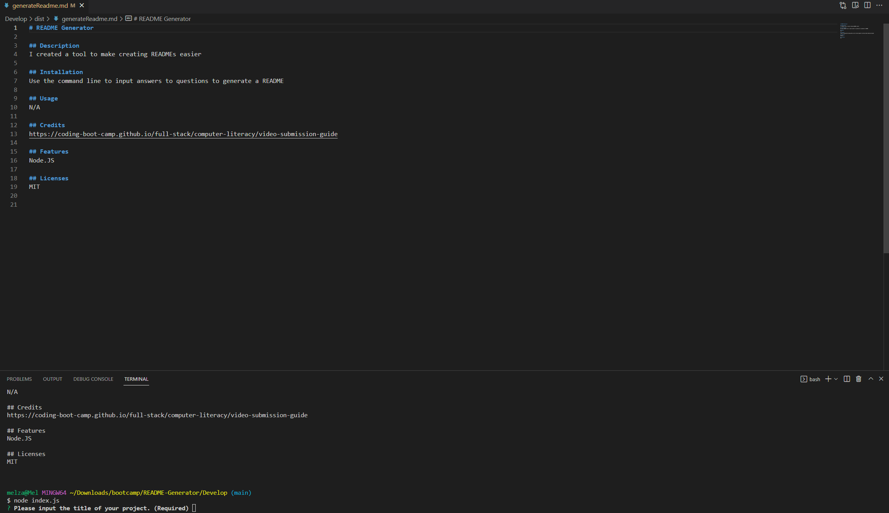

# README Generator

## Description

I created a tool that functions as a README Generator.

## Installation

- Use the command line to input your answers to the questions
- a README will be generated 

## Usage 

This tool was created to practice the following skills:
- JavaScript
- Node.JS
- Using Markdown to write a README

#### The work done can be found on the GitHub repository [zahirovic/README-Generator](https://github.com/zahirovic/README-Generator) and should look along the lines of this:

## Credits
- [Potential-Enigma](https://github.com/coding-boot-camp/potential-enigma#readme) for the starter code
- [Node.JS](https://nodejs.org/en/)
- [Inquirer](https://www.npmjs.com/package/inquirer/v/8.2.4)
- [Professional README Guide](https://coding-boot-camp.github.io/full-stack/github/professional-readme-guide)

## Features
- JavaScript
- Node.JS
 
